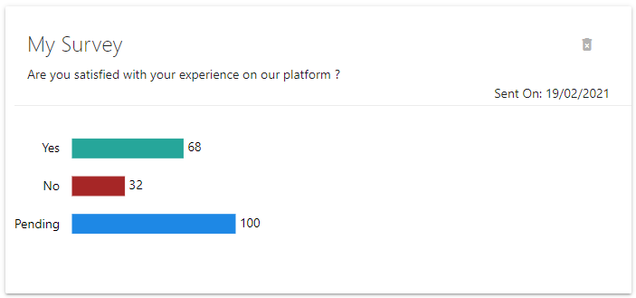

# Loop
## Fullstack feedback-collection app in NodeJs and React 

Collect feeback from your users!
LOOP allows you to send surveys to a list of recipients regarding your application in order to get feedback

Every recipient will have the opportunity to answer with a simple "yes" or "no"

Connect to the app using your google account and review your surveys' results at any time.

One survey for one credit

[Click here to access Loop on Heroku](https://blooming-mesa-01483.herokuapp.com/)

>### Disclaimer : This App is meant as a portfolio app only. It will not work with actual credit cards. if you wish to test it, add credits to your account with a fake credit card number such as 4242 4242 4242 4242. Any expiration Date and CVC will do the trick.

> First loading may take a few seconds since the app is deployed on Heroku's free tier

This app uses NodeJs, React, redux, express and mongoDb.

This project was coded following [this course](https://www.udemy.com/course/node-with-react-fullstack-web-development/) on Udemy by [Stephen Grider](https://www.udemy.com/course/node-with-react-fullstack-web-development/#instructor-1). 

I later customized the front-end and added a few functionalities (inverse survey list, survey graph, delete button for each survey, sub menu for navigating through the app and general color scheme)

